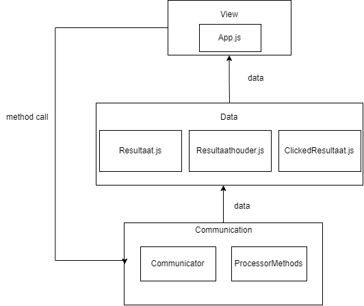

# Brt namenzoeker  
  
## Inleiding  
Dit is de app documentatie. Hier wordt de algemene opzet van de applicatie beschreven. Voor code documentatie bekijk de inline comments. 
  
## Applicatie opbouw  
De applicatie is gemaakt met React. De applicatie gebruikt MVC.
  
De applicatie bestaat uit drie lagen.   
- De View laag.  
- De Data laag.  
- De Communicator laag.  
  
  
  
De view laag weet in principe niet wat er getoond wordt. De view laag format niet zelf de teksten die geplaatst worden in de applicatie.
  
De Data laag zijn een aantal classen die dienen als containers. Deze worden gevuld met data en gelezen door de front-end.  
  
De communication doet sparql requesten naar verschillende endpoints. Deze requesten worden gerequest door de gebruiker via 
de view laag. 

Ook heeft de communicator laag een file met methodes(ProcessorMethods).
Deze file bevat methodes die de Communication en View laag gebruiken. De View laag roept deze methodes aan om aantal dingen te verwerken zonder dat de a view laag implementatie details bevat.

## Data laag
### Resultaat.js
Dit zijn de resultaten die aan de zijkant worden getoond. Deze class bevat de waarden : url , naam, type, geoJson, color, objectClass.
Color is de kleur die getoond wordt op de kaart. Dit kunnen één van de volgende kleuren zijn : turqoise, purple, green, red, pink, blue, orange, yellow en mediumaquamarine. De objectClass is bijv gebouw. 
  
## Webworker  
Deze applicatie heeft ook een webworker. Deze webworker zorgt ervoor dat de ui thread niet geblokkeerd wordt.
De webworker handelt het clusteren van objecten af. De clusterObjects in ProcessorMethods roept deze functie aan. Als je de Resultaat.js
class blijft gebruiken moet je in principte de webworker en clusterObjects methode kunnen hergebruiken.  
  
## Veranderen van backend  
Om van backend te veranderen moet de communicatie laag verandert worden. De methodes die nu al geimplementeert zijn moeten opnieuw
geschreven worden. Deze methodes zijn:  
- Communicator  
  - getOptions()  
  - getMatch()  
  - getAllAttribtes()  
  - getFromCoordinates()  
  
- ProcessorMethods  
  - isShownClickedResults()  
  - sortByObjectClass() 
  
Nu zijn er verschillende bestanden voor verschillende backends. Als er zometeen maar één backend komt kan je dit 
implementeren in de Communicator.js file.  
  
### getOptions()  
Hier kan je verschillende backend opties aangeven die de applicatie kan gebruiken. Als je er maar 1 meegeeft verdwijnt het tandwieltje links onder in.
Als je dit er helemaal uit wilt halen, moet je de in de App.js in de render methode de gearicon eruit halen. zie code voor meer details.
  
### getMatch()
Dit is de methode die de View laag aanroept wanneer er iets ingetypt wordt door de gebruiker. Je krijgt een string. Aan de hand van deze string kan je dus een search query opstellen.
De front end verwacht een lijst met Resultaat.js objecten. Zie de huidige implementatie voor meer details.
    
### getAllAttribtes()  
Deze methode wordt aangeroepen als er op een object wordt geklikt. Deze methode krijgt een ClickedResultaat.js object terug waarop is geklikt.
Dus vanaf de uri kan je weer alle andere attributen ophalen. De applicatie verwacht dat je deze attributen met de loadInAttributes() aanvult. De methode verwacht de volgende argumenten : 
naam, naamOfficieel, naamnl, naamfries, type, overige, burgNaam, tunnelNaam, sluisNaam, knoopPuntNaam.  De type en overige zijn arrays. De overige verwacht een array met {key: string, value: string}.
  
De namen zijn verschillende namen die het object kan hebben. De type is de het type object. Overige zijn alle overige attributen. **De type en overige zijn array's**

### getFromCoordinates()   
Wanneer de gebruiker met de rechter muisknop op de kaart klikt wordt deze methode aangeroepen. Je krijgt de volgende argumenten: lat, long, top, left, bottom, right.  
  
De lat en long zijn de coordinaten waar is geklikt. De top, left, bottom, right zijn de coordinaten van de viewbox.

### isShownClickedResults()  
Dit is een methode die wordt aangeroepen wanneer de kaart de rechter muisknop objecten wilt tonen. Hier kan je dus dingen eruit filteren, Ik vond het bijvoorbeeld niet mooi om provincies ook te tonen wanneer er met de rechter muisknop op de kaart werd geklikt.

### sortByObjectClass()  
De naam van deze methode is slecht. Deze methode wordt aangeroepen om de layering te bepalen. In de methode kan je bijvoorbeeld de provincies naar beneden layeren waardoor deze helemaal onderin worden getoond.

## Tips
Er zitten een aantal methodes in die je gewoon kan hergebruiken zolang je Resultaat.js gebruikt. Bijvoorbeeld het clusteren moet nog steeds werken.
Je hoeft alleen dingen op te halen van de backend. Om te zetten naar Resultaat.js objecten en hierna deze weer terug te geven.
Als het goed is hoef je helemaal niet aan de view of data laag te zitten.

